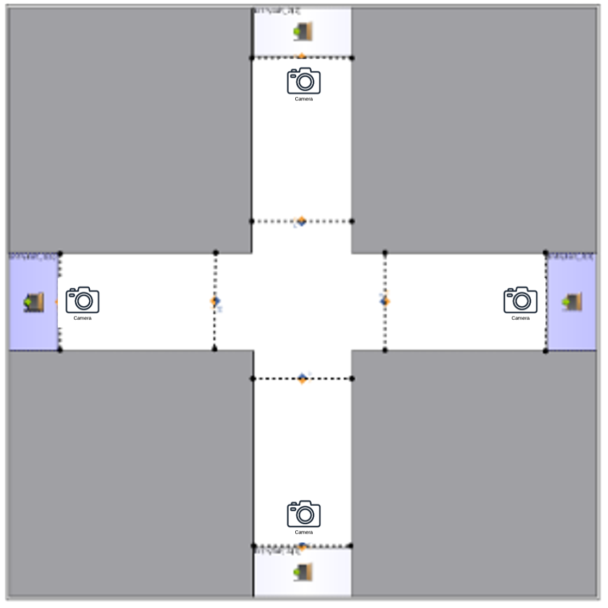
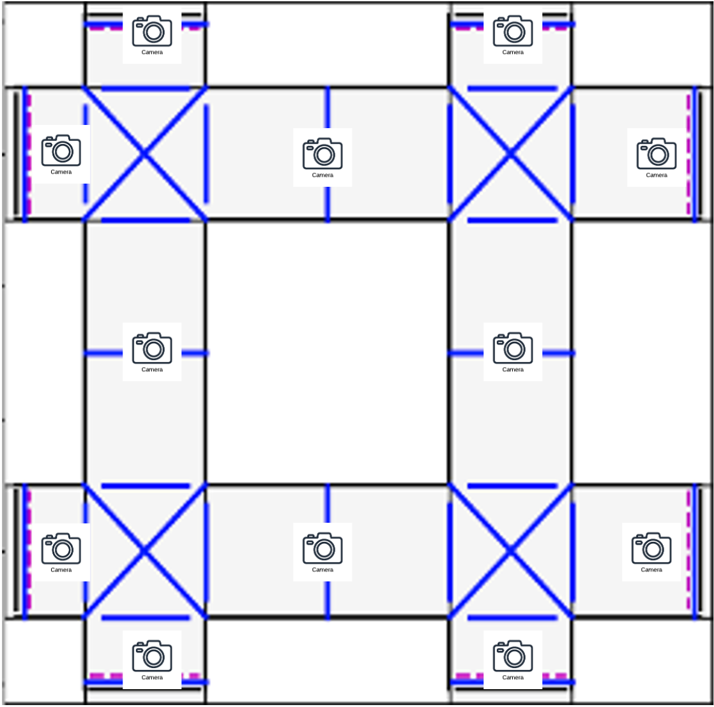
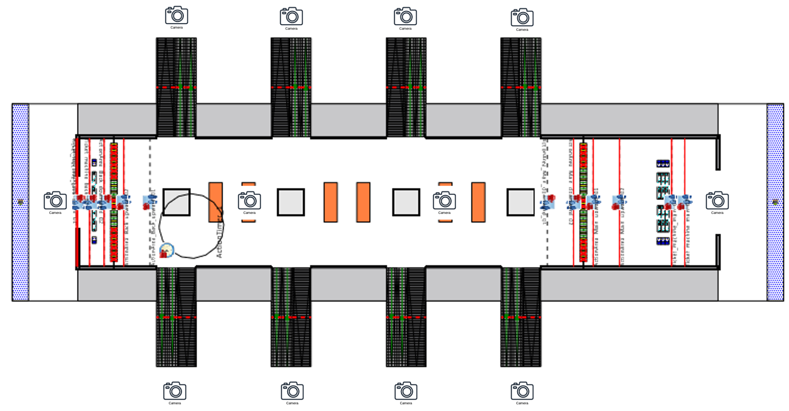

# Crowd-Flow-Inference

## Project Structure
```
Crowd-Flow-Inference/
├── checkpoint/
│   ├── {model_name}/
│   │   └── model.pth
│   └── {Online_model_name}.pth
├── notebooks/
│   ├── Online_Exp.ipynb
│   ├── Offline_Analysis.ipynb
│   └── Offline_Exp.ipynb
├── src/
│   ├── Diffusion_Network4.py
│   ├── simple_visualisation.py
│   ├── output_manager.py
│   └── NOMAD_cmd.py
├── graphs/
│   ├── graphs.bin
├── data/
│   └── simple_corr_example_2048342406_20240219074041.scen
├── README.md
└── requirements.txt
```
- checkpoint/: Directory for storing model checkpoints.
- notebooks/: Directory for Jupyter notebooks.
- src/: Directory for source code files.
- data/: Directory for data files.
- README.md: Project documentation.
- requirements.txt: List of dependencies.
- graphs/: Directory for storing the graph data, i.e., the distance matrix. graphs.bin is the graph data file of the three infrastructures. We use function `save_graph`in `DGL` to generate the `graphs.bin` file.

Initial model in ./checkpoint/{model_name}/model.pth

Model after online training in ./checkpoint/{Online_model_name}.pth

Online_Exp.ipynb is the notebook for visualization of the online training prediction, FD, OD

Offline_Analysis.ipynb is the notebook for visualization of the initialize model prediction, FD, OD

Offline_Exp.ipynb: not in use

The best model setup is in Diffusion_Network4.py


## Syhnthetic Data Generation

### Cross Road

The $CossRoad$ is the most basic infrastructure. We develop this simulation using the simulator $PedestrianDynamic$. There are four entrances and exits in the $CrossRoad$ infrastructure, forming a simple intersection where pedestrian flow can be observed from multiple directions. Pedestrians enter the building from one of the four entrances and choose an exit with varied probabilities. The walking speed of the pedestrians follows a triangular distribution $Triangular(1.35, 0.8, 1.75)$, indicating that the lowest walking speed is 0.8 m/s, the highest is 1.75 m/s, and the mode is 1.35 m/s. The flow rate of 
each entrance ranges from 1 to 8 (peds/10s).

<div style="text-align: center;">
    
</div>


### Maze
The $Maze$ infrastructure is a more complex version of $CrossRoad$ infrastructure, consisting of multiple interconnected hallways and intersections. This design allows for more intricate routes and interactions. The simulation is built using the simulator $Nomad$.

The flow rate at each entrance ranges from 0 to 3 (peds/10s). To simulate changes in demand, this flow rate varies over time. Pedestrian walking speed follows a normal distribution with a mean of 1.5 m/s and a standard deviation of 0.6 m/s. 
To prevent extreme velocities, the speed is
bounded with a minimum of 0.2 m/s and a maximum of 1.6 m/s.

To scale a picture in Markdown, you can use HTML tags. Here is an example of how to scale an image:

<div style="text-align: center;">
    
</div>


### Train Station
The $Train Station$ infrastructure simulates a real-world transit hub, featuring multiple platforms, ticketing areas, and entrances/exits. The simulation is developed based on $PedestrianDynamic$.

In each scenario, the agent generator generates a group of people at each time interval. The number of people in this group follows a uniform distribution $U(2,5)$, meaning that 2 to 5 people will be in this group. The time interval is a random variable following an exponential distribution, such that the arrival of the passenger groups follows a Poisson distribution. We set the mean interval $s=2$ for the rush hour condition, which means that on average every 2 seconds a group of passengers would arrive at the station. For off-peak hours, we set $s=4$. The demand for each train line is described by the probability that passengers will take that line. We categorize demand levels as high, normal, and low for a specific train line. For example, the demand distributions for line 1 are: high: $[52\%, 16\%, 16\%, 16\%]$, normal: $[25\%, 25\%, 25\%, 25\%]$, and low: $[10\%, 30\%, 30\%, 30\%]$.

The maximum walking speed follows the triangular distribution $Triangular(2, 1.5, 2.5)$ under high-throughput conditions, indicating that the lowest maximum walking speed is 1.5 m/s, the highest is 2.5 m/s, and the mean is 2 m/s. Under normal conditions, the maximum walking speed follows $Triangular(1.35, 0.8, 1.75)$.

<div style="text-align: center;">
    
</div>
